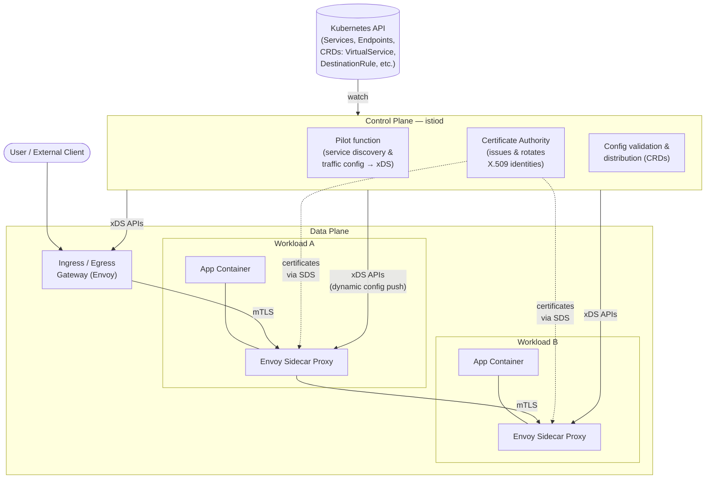
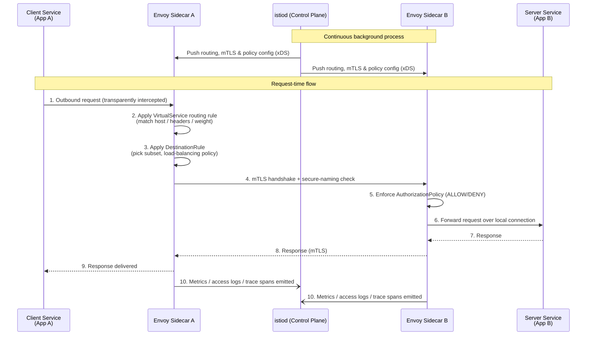
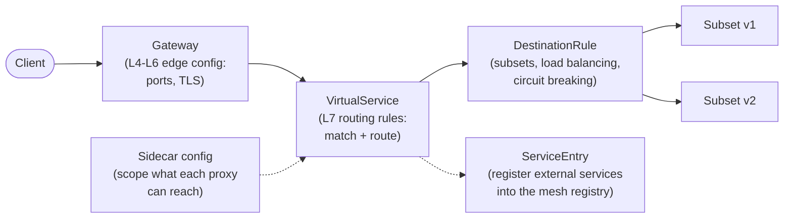
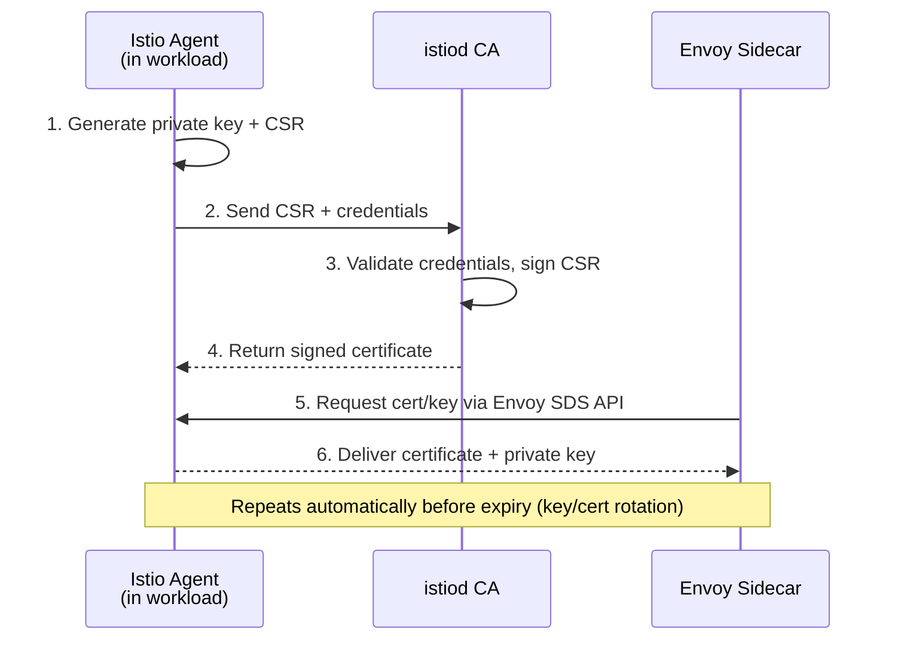
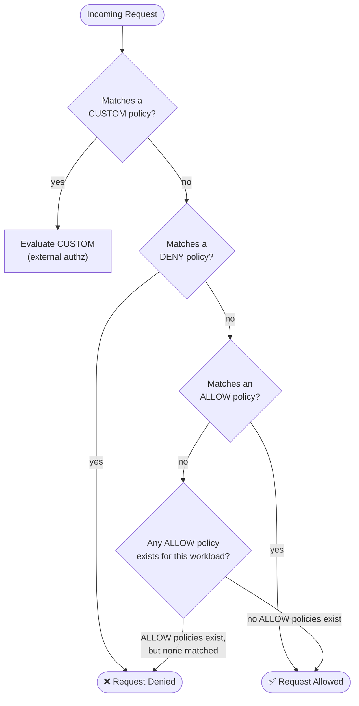
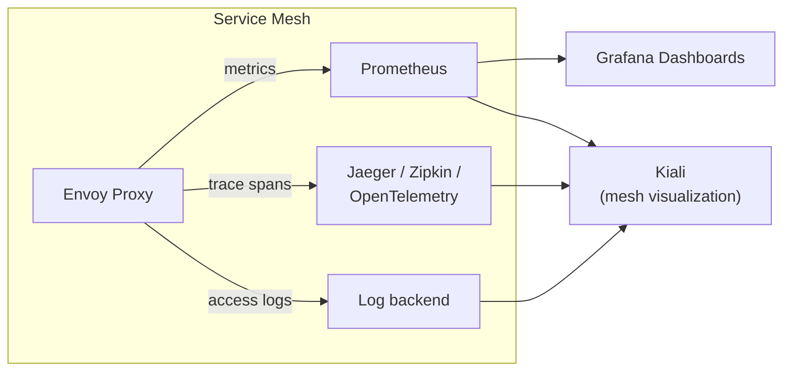
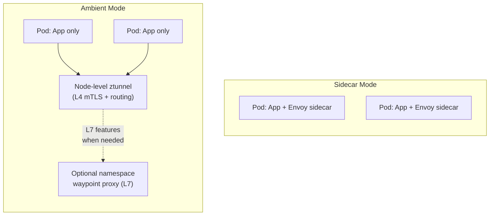

# Istio Service Mesh — Trainer Guide

**Audience:** Platform, DevOps, Cloud, and Security engineers new to service mesh concepts
**Format:** Instructor-led / self-paced technical training
**Source:** Adapted from official Istio documentation (istio.io) — links provided at the end of each section

---

## Table of Contents

1. [What is Istio?](#1-what-is-istio)
2. [Why Do We Need Istio?](#2-why-do-we-need-istio)
3. [Istio Architecture](#3-istio-architecture)
4. [How Istio Works — Request Flow](#4-how-istio-works--request-flow)
5. [Core Traffic Management Building Blocks](#5-core-traffic-management-building-blocks)
6. [Security in Istio](#6-security-in-istio)
7. [Observability in Istio](#7-observability-in-istio)
8. [Sidecar vs Ambient Mode](#8-sidecar-vs-ambient-mode)
9. [Trainer Notes & Talking Points](#9-trainer-notes--talking-points)
10. [Quick Reference Glossary](#10-quick-reference-glossary)

---

## 1. What is Istio?

Istio is an **open source service mesh** that layers transparently on top of an existing distributed application, giving teams a uniform way to secure, connect, and observe services without changing application code.

At a glance, Istio provides:

- **Secure service-to-service communication** — mutual TLS (mTLS) encryption plus strong, identity-based authentication and authorization
- **Automatic load balancing** for HTTP, gRPC, WebSocket, and TCP traffic
- **Fine-grained traffic control** — routing rules, retries, failovers, and fault injection
- **A pluggable policy layer** — access control, rate limits, and quotas
- **Automatic telemetry** — metrics, logs, and distributed traces for every request in the mesh, including ingress and egress

Istio's control plane runs on Kubernetes, but the mesh isn't limited to a single cluster — it can be extended across multiple clusters, and workloads running on VMs outside Kubernetes can be joined to the same mesh.

> **Trainer tip:** Frame Istio as "a network team riding along inside every service," not as a new piece of infrastructure the developer has to code against. That distinction — *transparent* vs. *invasive* — is the single most important idea in this module.

**Reference:** [What is Istio? — istio.io](https://istio.io/latest/docs/overview/what-is-istio/)

---

## 2. Why Do We Need Istio?

### The problem: microservices break the old networking assumptions

When an application is a single monolith, "networking" is mostly a solved problem — one process, one deployable, one place to add logging or auth. Break that monolith into dozens or hundreds of independently deployed microservices, and every one of those concerns has to be re-solved **per service, per language, per team**:

| Concern | Monolith | Microservices without a mesh |
|---|---|---|
| Service discovery | In-process function call | Every service reinvents client-side discovery |
| Load balancing | N/A | Duplicated in every client library |
| Retries / timeouts / circuit breaking | N/A | Hand-rolled, inconsistent per team |
| Encryption between components | N/A (same process) | Often skipped — "it's an internal network" |
| Access control between services | N/A | Ad-hoc, hard to audit |
| Observability (who called whom, how long, how often) | Simple stack trace | Needs distributed tracing infrastructure |
| A/B testing, canary releases | Manual | Requires custom routing logic in every service |

Without a mesh, teams either accept these gaps (a common source of outages and security incidents) or spend significant engineering time building the same networking logic — retries, TLS, load balancing, tracing — into every service and every language runtime.

### The solution: push these concerns into the infrastructure layer

Istio's core idea is to move traffic management, security, and observability **out of application code and into a proxy that sits next to (or in front of) every workload**. Because the proxy intercepts all network traffic, it can:

- Encrypt traffic automatically (mTLS) without a single line of app code
- Apply consistent retry/timeout/circuit-breaking policy regardless of language
- Emit uniform metrics, logs, and traces for every request
- Enforce access-control and authentication policy centrally, and update it live

### Why this matters for specific roles (trainer talking points)

- **Platform / Infra teams:** one place to enforce mTLS, rate limits, and mesh-wide policy instead of chasing every service team
- **Security teams:** zero-trust networking by default — identity-based, encrypted service-to-service traffic and centrally auditable access policy
- **Application teams:** retries, timeouts, canary rollouts, and A/B testing become YAML configuration, not code they have to write and maintain
- **SRE / Observability teams:** golden-signal metrics (latency, traffic, errors, saturation), access logs, and distributed traces come for free for every service in the mesh

**Reference:** [What is Istio? — istio.io](https://istio.io/latest/docs/overview/what-is-istio/), [Traffic Management concepts — istio.io](https://istio.io/latest/docs/concepts/traffic-management/), [Security concepts — istio.io](https://istio.io/latest/docs/concepts/security/)

---

## 3. Istio Architecture

Istio is split into two logical planes:

- **Control plane (`istiod`)** — the "brain." It watches the platform (e.g., Kubernetes) for services and endpoints, translates your Istio configuration (VirtualService, DestinationRule, AuthorizationPolicy, etc.) into proxy-level configuration, and pushes it out dynamically.
- **Data plane (proxies)** — the "muscle." Envoy proxies intercept every request in and out of a workload and enforce whatever the control plane has told them to do: routing, retries, mTLS, access control, and telemetry collection.

### Control plane responsibilities (`istiod`)

- **Service discovery** — connects to the platform's discovery system (e.g., Kubernetes) to learn about services and endpoints automatically
- **Configuration translation** — turns your `VirtualService`, `DestinationRule`, `Gateway`, `AuthorizationPolicy`, and other CRDs into Envoy-native configuration
- **Dynamic distribution** — pushes updated configuration to every relevant proxy via Envoy's xDS discovery APIs, without proxy restarts
- **Certificate Authority (CA)** — issues and automatically rotates a strong X.509 identity for every workload, which underpins mutual TLS

### Data plane responsibilities (Envoy proxies)

- **Traffic interception** — every request into or out of a workload passes through its proxy
- **Policy enforcement** — the proxy is the *Policy Enforcement Point (PEP)* for routing rules, retries, circuit breaking, mTLS, and authorization
- **Telemetry generation** — metrics, access logs, and trace spans are generated at the proxy, uniformly, regardless of what language the application is written in

**Reference:** [Traffic Management concepts — istio.io](https://istio.io/latest/docs/concepts/traffic-management/), [Security concepts (high-level architecture) — istio.io](https://istio.io/latest/docs/concepts/security/)

---

## 4. How Istio Works — Request Flow

### 4.1 The big picture

> **Istio uses a proxy to intercept all your network traffic, allowing a broad set of application-aware features based on configuration you set. The control plane takes your desired configuration and its view of the services, and dynamically programs the proxy servers, updating them as the rules or environment change.**

In other words: **you declare intent (YAML), Istio compiles that intent into live proxy configuration, and the proxies enforce it on every packet.**

### 4.2 End-to-end sequence: a single request through the mesh

Walking through it:

1. **Interception** — the application makes a normal network call; it has no idea a proxy exists. Traffic is transparently redirected to the local Envoy sidecar.
2. **Routing decision (VirtualService)** — Envoy checks routing rules evaluated top-to-bottom (host match, header match, URI match, weighted split) to decide *which* backend subset the request should go to.
3. **Traffic policy (DestinationRule)** — once a destination is chosen, Envoy applies load-balancing policy, circuit-breaker thresholds, and connection-pool settings for that specific subset.
4. **Mutual TLS handshake** — the client-side proxy and server-side proxy establish an encrypted, mutually authenticated connection, including a *secure naming* check that the server's certificate identity is actually authorized to run that service.
5. **Authorization enforcement** — the server-side Envoy evaluates any `AuthorizationPolicy` objects and allows or denies the request.
6. **Local delivery** — only after all of the above does the request reach the actual application container, over a local (plaintext, since it's inside the pod) connection.
7. **Telemetry** — regardless of outcome, both proxies emit standardized metrics, access logs, and trace spans back toward the observability stack.

**Reference:** [What is Istio? — How it works](https://istio.io/latest/docs/overview/what-is-istio/#how-it-works), [Traffic Management concepts](https://istio.io/latest/docs/concepts/traffic-management/), [Security concepts — mutual TLS authentication](https://istio.io/latest/docs/concepts/security/)

---

## 5. Core Traffic Management Building Blocks

Istio's traffic behavior is controlled through a small set of Kubernetes Custom Resource Definitions (CRDs). Understanding how they compose is the core skill for this module.

| Resource | Purpose | Analogy |
|---|---|---|
| **VirtualService** | Defines *how* requests are routed to a service — by header, URI, weight/percentage, etc. Rules are evaluated top-to-bottom; the first match wins. | A signpost: "requests like *this* go *there*." |
| **DestinationRule** | Defines what happens to traffic *after* it's been routed to a destination — named subsets (e.g., by app version), load-balancing algorithm, TLS mode, circuit-breaker settings. | The delivery policy once you've picked the destination. |
| **Gateway** | Manages inbound/outbound traffic at the *edge* of the mesh (L4-L6: ports, TLS termination). Bound to a VirtualService for L7 routing. | The mesh's front door. |
| **ServiceEntry** | Adds an external (non-mesh) service to Istio's internal service registry so it can be routed, retried, and secured like any in-mesh service. | A visitor badge for external dependencies. |
| **Sidecar** | Scopes which ports/protocols a proxy accepts and which services it can reach — useful for large meshes to reduce memory/config overhead. | Blinders that keep each proxy focused on what it actually needs to know. |

### Everyday capabilities built on these primitives

- **Canary / A/B rollouts** — weighted routing across service subsets (e.g., 90% `v1` / 10% `v2`) via `VirtualService`
- **Timeouts & retries** — per-service timeout and retry-with-backoff policy, set declaratively, no code changes
- **Circuit breaking** — connection/request limits per host in a `DestinationRule`, so one failing instance can't cascade
- **Fault injection** — deliberately injected delays or aborted requests to test resilience before it's tested in production
- **Locality-aware load balancing** — prefer routing within the same zone/region, with automatic failover

**Reference:** [Traffic Management concepts — istio.io](https://istio.io/latest/docs/concepts/traffic-management/)

---

## 6. Security in Istio

Istio's security model is built for a **zero-trust network**: security by default (no app changes needed), defense in depth, and no assumption that the internal network is safe.

### 6.1 Identity and certificate provisioning

Every workload gets a strong, automatically-rotated identity (an X.509 certificate), issued by `istiod`'s built-in Certificate Authority.

### 6.2 Authentication — two layers

- **Peer authentication (mTLS)** — service-to-service. Istio can enforce this in `STRICT` mode (mTLS only), `PERMISSIVE` mode (accepts both plaintext and mTLS — useful mid-migration), or `DISABLE`.
- **Request authentication (JWT)** — end-user / caller identity, validated via JSON Web Tokens against an OIDC-compatible provider (e.g., Auth0, Keycloak, Google).

### 6.3 Authorization

Once a request is authenticated, `AuthorizationPolicy` resources decide whether it's *allowed*:

- Policies specify a `selector` (which workloads it applies to), an `action` (`ALLOW`, `DENY`, or `CUSTOM`), and `rules` (`from` = who, `to` = what operation, `when` = extra conditions).
- Evaluation order is **`CUSTOM` → `DENY` → `ALLOW`** — deny rules are always checked before allow rules, so a deny policy can't be bypassed by an allow policy.
- If a workload has no authorization policy at all, Istio allows all traffic to it by default; the moment *any* `ALLOW` policy is applied, unmatched traffic is denied by default ("allow-listing" behavior).

**Reference:** [Security concepts — istio.io](https://istio.io/latest/docs/concepts/security/)

---

## 7. Observability in Istio

Istio automatically generates the three pillars of observability for **every** request in the mesh, without any application instrumentation:

| Signal | What it gives you | Typical backend |
|---|---|---|
| **Metrics** | The four golden signals — latency, traffic, errors, saturation — at both proxy level and aggregated service level, plus control-plane self-monitoring metrics | Prometheus + Grafana |
| **Distributed traces** | Per-request trace spans showing the full call path across services, exposing where latency is coming from | Jaeger, Zipkin, OpenTelemetry, SkyWalking |
| **Access logs** | A full record of every request — source, destination, response code, timing — down to the individual workload instance | Any log aggregation stack (via Envoy / OpenTelemetry) |

**Trainer tip:** This is a great "wow" moment in a live demo — deploy the Bookinfo sample app, generate a little traffic, and open Kiali to show the live traffic graph, error rates, and latency without writing a single line of instrumentation code.

**Reference:** [Observability concepts — istio.io](https://istio.io/latest/docs/concepts/observability/)

---

## 8. Sidecar vs Ambient Mode

Istio supports two data-plane deployment models:

| | **Sidecar mode** | **Ambient mode** |
|---|---|---|
| Deployment unit | One Envoy proxy **per pod**, injected alongside the app container | A shared **per-node** Layer 4 proxy (`ztunnel`), plus optional **per-namespace** Envoy waypoint proxies for Layer 7 features |
| App changes | None | None |
| Resource overhead | Proxy resource cost scales per pod | Lower baseline overhead; L7 features opt-in per namespace |
| Best for | Full-feature use cases needing L7 control everywhere | Simpler onboarding, lower resource footprint, incremental adoption of L7 features only where needed |

**Reference:** [What is Istio? — How it works](https://istio.io/latest/docs/overview/what-is-istio/#how-it-works), [Sidecar or ambient? — istio.io](https://istio.io/latest/docs/overview/dataplane-modes/)

---

## 9. Trainer Notes & Talking Points

Suggested flow for a live session (60–90 minutes):

1. **Open with the pain (10 min)** — draw the "microservices without a mesh" table on a whiteboard; ask the room how many of these problems they've hit personally. This grounds "why Istio" before any architecture slide.
2. **Introduce the two planes (15 min)** — control plane vs. data plane. Use the architecture diagram. Emphasize: *config is declared once, enforced everywhere, updated live, no proxy restarts.*
3. **Walk the request flow diagram live (15 min)** — trace a single request step by step. This is the moment most people's mental model "clicks."
4. **Live demo: Bookinfo + traffic shifting (20 min)** — deploy Bookinfo, apply a `VirtualService` that shifts traffic 90/10 between `reviews` v1/v2, show it live in Kiali.
5. **Security demo (10 min)** — show `PeerAuthentication` in `STRICT` mode, then show a denied request in Kiali/logs when an `AuthorizationPolicy` blocks it.
6. **Q&A / discuss sidecar vs. ambient for their environment (10–15 min)**.

Common misconceptions to pre-empt:

- "Istio replaces Kubernetes Ingress" — no, it *can* replace or complement it via Gateway + VirtualService, but it's not required to remove existing ingress on day one.
- "mTLS means my app doesn't need any of its own auth" — mTLS secures service identity; request-level (end-user) auth via JWT is a separate, complementary layer.
- "Sidecar injection instruments my code" — it does not; Envoy operates purely at the network layer and requires zero application code changes.

---

## 10. Quick Reference Glossary

| Term | Definition |
|---|---|
| **istiod** | The unified Istio control plane component — service discovery, configuration processing/distribution, and Certificate Authority |
| **Envoy** | The high-performance proxy Istio uses as its data plane, deployed either as a sidecar or as ztunnel/waypoint in ambient mode |
| **xDS** | Envoy's family of discovery APIs (e.g., LDS, RDS, CDS, EDS) used by the control plane to push dynamic configuration |
| **PEP** | Policy Enforcement Point — where mTLS and authorization are actually enforced (the Envoy proxy) |
| **VirtualService** | CRD defining L7 routing rules for one or more hostnames |
| **DestinationRule** | CRD defining subsets and traffic policy (load balancing, circuit breaking, TLS) for a destination |
| **Gateway** | CRD configuring edge (ingress/egress) L4-L6 proxy behavior |
| **ServiceEntry** | CRD registering an external service into Istio's internal service registry |
| **Sidecar (CRD)** | CRD scoping a proxy's reachable ports/services (distinct from "sidecar mode" the deployment pattern) |
| **PeerAuthentication** | CRD controlling mTLS mode (`STRICT` / `PERMISSIVE` / `DISABLE`) between workloads |
| **RequestAuthentication** | CRD controlling JWT validation for end-user requests |
| **AuthorizationPolicy** | CRD controlling `ALLOW` / `DENY` / `CUSTOM` access rules between workloads |
| **ztunnel** | The per-node Layer 4 proxy used in ambient mode |
| **Waypoint proxy** | An optional per-namespace Envoy proxy in ambient mode providing Layer 7 features |

---

## Sources

All content in this guide is adapted from the official Istio documentation:

- [What is Istio?](https://istio.io/latest/docs/overview/what-is-istio/)
- [Concepts — Traffic Management](https://istio.io/latest/docs/concepts/traffic-management/)
- [Concepts — Security](https://istio.io/latest/docs/concepts/security/)
- [Concepts — Observability](https://istio.io/latest/docs/concepts/observability/)
- [Sidecar or ambient?](https://istio.io/latest/docs/overview/dataplane-modes/)

*Diagrams use [Mermaid](https://mermaid.js.org/) syntax and will render automatically in GitHub, GitLab, most modern Markdown viewers, and the Mermaid Live Editor.*
